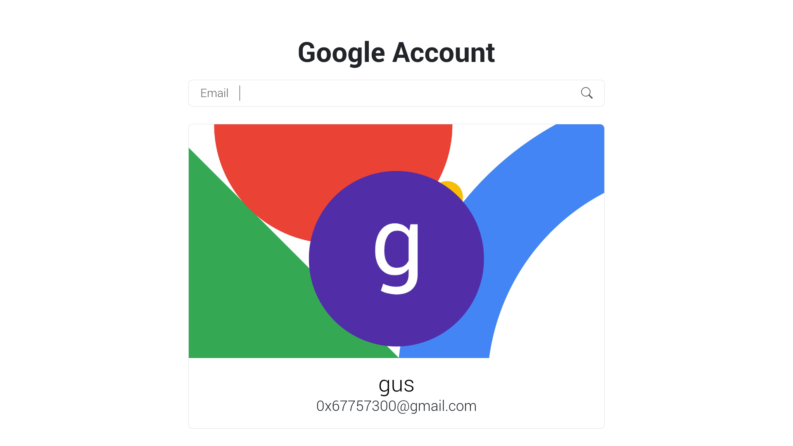

# Google Account

Find Google Accounts by email.



## Usage

First you must install the dependencies.

```bash
git clone https://github.com/0x67757300/GoogleAccount
cd GoogleAccount
python3 -m venv venv
source venv/bin/activate
pip install -r requirements.txt
```

Then, login to Google on Firefox.

Finally, just run `app.py` with the browser's cookies as argument.

```bash
./app.py ~/.mozilla/firefox/jpeeiqto.default-release/cookies.sqlite
```

## Contributions

All contributions are welcomed.

## License

Released in the public domain under the 0BSD license.
